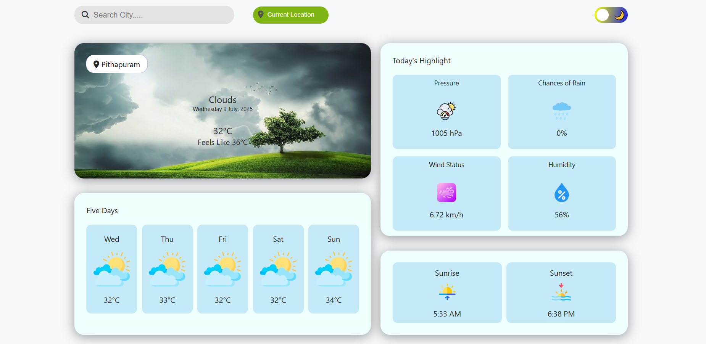
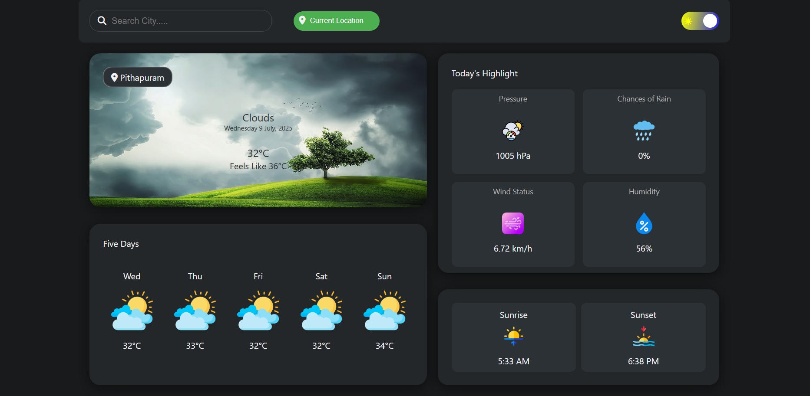

# Weather Forecast App

A simple weather app that shows real-time weather and 5-day forecast using OpenWeatherMap API. Built with HTML, CSS, JavaScript and deployed via GitHub Pages.

## Features

- The **background image changes dynamically** based on the current weather condition (e.g., sunny, cloudy, rainy, foggy).
- Search weather by city name
- Get weather using current location
- 5-day forecast with custom icons
- Light / Dark theme toggle
- Mobile responsive design
- Shows today's date and weather highlights
- Stores location preference (with `localStorage`)

## 📸 Preview

### 🌤 Light Mode



### 🌙 Dark Mode



### 📱 Mobile View

1 Current Weather\*\*

.png>)

2 Today Highlights

.png>)

## 📁 Folder Structure

````weather forecast/
│
├── assets/
│ ├── changingcondition/ # Backgrounds for current
condition
├── forecastimages/ # Custom icons for forecast
│ ├── highlights/ # Custom icons for today highlights
│ ├── PreviewImages # Screenshots
│ └── searchicon.png
│
├── index.html # Main HTML file
├── style.css # Styling
├── script.js # JavaScript logic
└── README.md # This file```
````
